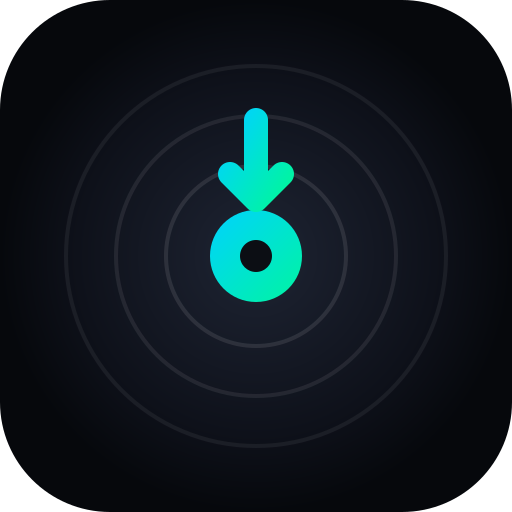

# 🎧 DjPaz - Professional Web DJ Studio & Hardware Integration

<p align="center">
  
</p>

<p align="center">
  <strong>Estación de mezcla digital para DJ profesional en tiempo real para navegador web con integración nativa de hardware para Hercules DJControl Inpulse 200 MK2 / 200, atajos de teclado para portátil y soporte 100% multiplataforma.</strong>
</p>

<p align="center">
  <a href="#-instalación-rápida-por-plataforma"></a>
  <a href="#-despliegue-con-docker"></a>
  <a href="#-compatibilidad-hardware"></a>
  <a href="#-atajos-de-teclado"></a>
  <a href="#-licencia"></a>
</p>

---

## 📑 Tabla de Contenidos
1. [Instalación Rápida por Plataforma](#-instalación-rápida-por-plataforma)
2. [Despliegue con Docker (Cualquier Sistema)](#-despliegue-con-docker)
3. [Control mediante Teclado de Portátil (Sin Hardware)](#-control-mediante-teclado-de-portátil)
4. [Mapeo MIDI Oficial Hercules DJControl Inpulse 200 MK2](#-mapeo-midi-oficial)
5. [Arquitectura de Audio y Modos de Performance](#-arquitectura-de-audio)
6. [Configuración de Red y Acceso Remoto](#-configuración-de-red)
7. [Servicio Continuo en Segundo Plano (systemd)](#-servicio-continuo-systemd)
8. [Créditos y Librerías Externas](#-créditos-y-librerías-externas)

---

## ⚡ Instalación Rápida por Plataforma

### 🐧 1. Linux (Ubuntu, Debian, Fedora, Arch, Manjaro)
```bash
git clone https://github.com/eiastudiofr-ops/DjPaz.git
cd DjPaz
./install.sh
```

### 🪟 2. Windows (1-Click)
1. Clona o descarga el repositorio:
   ```cmd
   git clone https://github.com/eiastudiofr-ops/DjPaz.git
   cd DjPaz
   ```
2. Haz doble clic en **`install.bat`** para instalar dependencias.
3. Para iniciar la aplicación, haz doble clic en **`start.bat`** (o ejecuta `start.ps1` en PowerShell).

### 🍏 3. macOS
```bash
brew install python ffmpeg yt-dlp git
git clone https://github.com/eiastudiofr-ops/DjPaz.git
cd DjPaz
./start.sh
```

Abre tu navegador en: 👉 **`http://localhost:4848`**

---

## 🐳 Despliegue con Docker

Para ejecutar **DjPaz** en cualquier servidor, NAS o equipo sin instalar dependencias locales:

```bash
# 1. Clonar el repositorio
git clone https://github.com/eiastudiofr-ops/DjPaz.git
cd DjPaz

# 2. Iniciar el contenedor
docker compose up -d
```
Tus pistas musicales colocadas en la carpeta `./music` se montarán automáticamente dentro del estudio.

---

## ⌨️ Control mediante Teclado de Portátil

Si no tienes la controladora Hercules conectada, puedes mezclar en cualquier ordenador usando el teclado:

| Acción | Deck A (Izquierda) | Deck B (Derecha) |
| :--- | :--- | :--- |
| **Play / Pause** | `Q` *(Shift + Q: Stutter)* | `U` *(Shift + U: Stutter)* |
| **CUE (Hold Preview / Jump)**| `W` *(Shift + W: 0:00)* | `I` *(Shift + I: 0:00)* |
| **SYNC (Match BPM / Reset)** | `E` *(Shift + E: Pitch 0%)* | `O` *(Shift + O: Pitch 0%)* |
| **Performance Pads 1 al 4** | Teclas `1`, `2`, `3`, `4` | Teclas `7`, `8`, `9`, `0` |
| **🎧 Preescucha Auriculares (PFL)** | `Tab` | `\` (o letra `P`) |
| **Play/Pause Global** | `Barra Espaciadora` | `Barra Espaciadora` |

---

## 🎛️ Mapeo MIDI Oficial (Hercules DJControl Inpulse 200 MK2)

| Control Físico | Función Normal | Con `SHIFT` Pulsado |
| :--- | :--- | :--- |
| **`PLAY / PAUSE`** | Reproducir / Pausar pista | **Cue Stutter:** reanuda desde el CUE en directo |
| **`CUE`** | Fijar punto CUE / Saltar / Mantener preview | **Regreso al inicio (0:00)** de la pista |
| **`SYNC`** | Cuadrar BPM y fase con el otro Deck | **Smooth Pitch Reset:** vuelve a `0.00%` |
| **`VINYL`** | Alterna modo Vinilo Scratch (LED rojo) | — |
| **`JOG WHEEL`** | Tocar centro = Scratch / Girar borde = Pitch Bend | **Needle Search:** búsqueda rápida adelante/atrás |
| **`LOOP IN`** | Fija punto inicial de bucle manual | **Dividir Loop (`1/2`):** reduce a la mitad |
| **`LOOP OUT`** | Fija punto final y activa bucle / Salir | **Duplicar Loop (`2X`):** duplica duración |
| **`M1 (HOT CUE)`** | Modo Hot Cue (LED fijo) | **Modo FX** (LED parpadeante) |
| **`M2 (STEMS / ROLL)`**| Modo Stems (LED fijo) | **Modo Sampler** (LED parpadeante) |
| **`BROWSER (Rueda)`**| Navegación por la lista de pistas | Cargar pista al presionar |
| **`ASSISTANT`** | Cicla niveles de energía IMA con anillo LED | — |
| **`🎧 1` y `🎧 2`** | Preescucha aislada en auriculares frontales | — |

---

## 🚀 Funciones Pro de VirtualDJ Integradas

* **🔴 Grabador de Sesiones en Vivo (`REC`):** Captura toda la mezcla de audio (Master + Micrófono + FX + Sampler) en calidad de estudio directa a archivo **WebM / WAV** descargable con un solo clic.
* **🌊 Vista General de Canción Completa (`Overview Waveform / Needle Drop`):** Barra interactiva con toda la duración de la pista de 0:00 a fin; haz clic en cualquier punto para saltar instantáneamente a la intro, drop o breakdown.
* **🔒 Key Lock / Master Tempo & Mezcla Armónica:** Bloqueo de tono musical independiente de la velocidad; detecta y muestra la tonalidad musical en notación **Camelot Wheel** (ej. `8A / Am`, `11B / A`).
* **⚡ Modo AutoMix Inteligente:** Transición automática entre Decks A y B con sincronización de BPM, compases y desplazamiento suave de crossfader.
* **🎤 Micrófono en Vivo con Auto-Ducking:** Canal de voz directo por altavoces que atenúa automáticamente la música de fondo (-12 dB) mientras el DJ habla.
* **🔁 Selector Rápido de Auto-Loop:** Botones de bucle cuantizado instantáneo a `1/2`, `1`, `2`, `4`, `8` y `16` compases.
* **🎯 TAP BPM & Ajuste Fino de Rejilla (`Grid Nudge`):** Botón TAP para calcular el tempo pulsando al ritmo y botones `«` `»` para desplazar la rejilla de compases.

---

## 🔊 Arquitectura de Audio y Performance Pads

* **Modo Hot Cue:** Salto y fijación instantánea de CUEs 1 al 4 (`SHIFT` para borrar).
* **Modo STEMS en Tiempo Real:** Aislamiento o Mute de **Vocales**, **Melodía**, **Bajos** y **Batería** (`SHIFT` para activar *SOLO*).
* **Modo Performance FX:** *HPF Build*, *1/2 Beat Echo*, *Flanger Jet* y *Vinyl Brake Motor Stop*.
* **Modo DJ Sampler:** Disparo de *Airhorn*, *Scratch Vocal*, *Impacto Láser* y *808 Sub Drop*.

---

## 🌐 Configuración de Red

Puedes cambiar el puerto, la dirección de escucha y la carpeta de biblioteca con parámetros CLI o variables de entorno:

```bash
# Puerto personalizado y carpeta de música propia:
python3 server.py --port 8080 --host 0.0.0.0 --music-dir "/ruta/a/mi/musica"

# O mediante variables de entorno:
export PORT=8080
export DJPAZ_MUSIC_DIR="D:\Musica"
./start.bat
```

---

## ⚙️ Servicio Continuo (systemd)

En sistemas Linux con systemd:
```bash
cp djpaz.service ~/.config/systemd/user/
systemctl --user daemon-reload
systemctl --user enable --now djpaz.service
```

---

## 📄 Licencia

Licencia **MIT**. Desarrollado con ❤️ para la comunidad de DJs y productores musicales.
